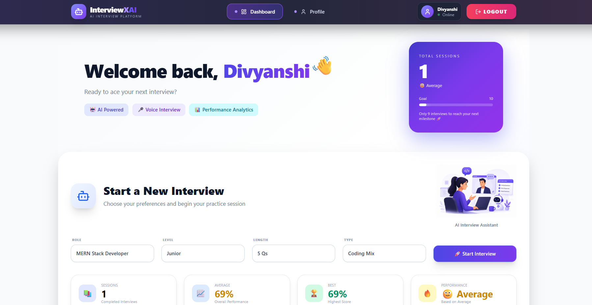
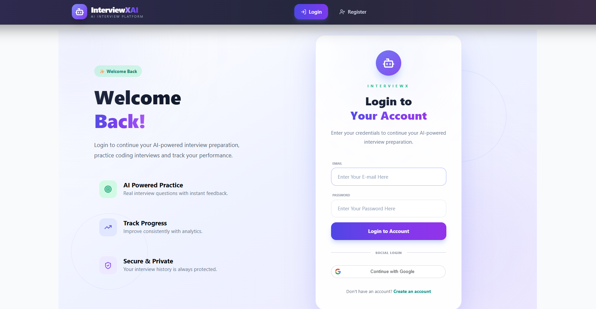
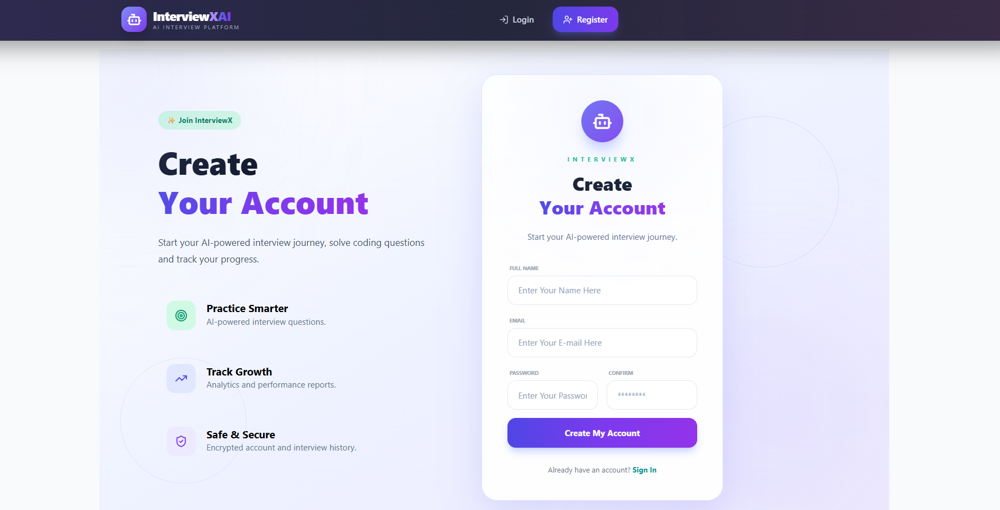
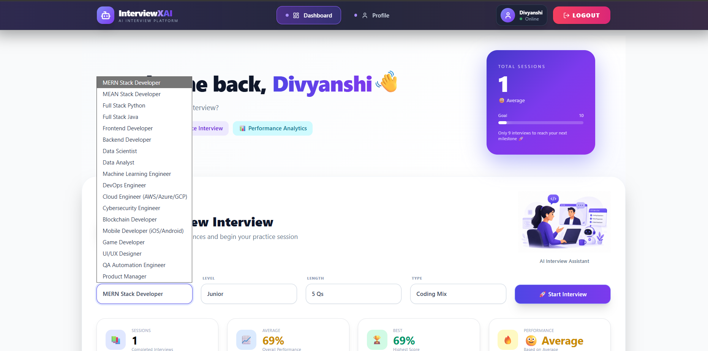
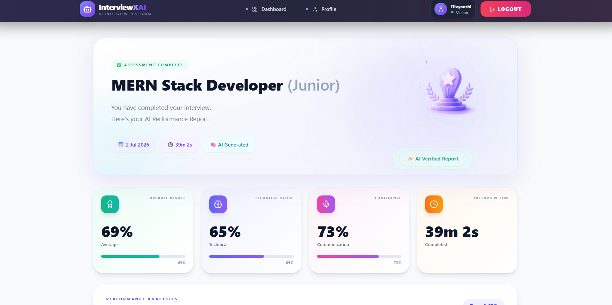
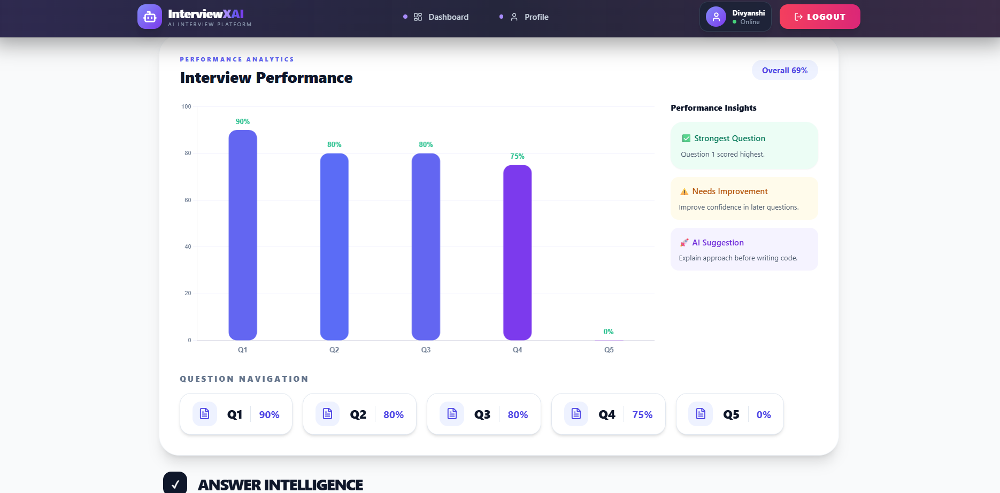
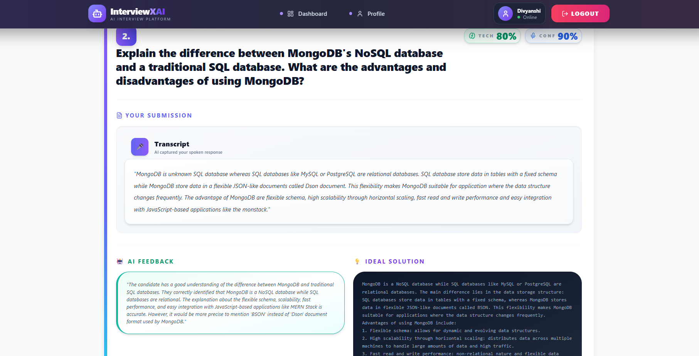

# 🚀 InterviewX AI

### AI-Powered Technical Interview Platform


Practice coding interviews, voice interviews, AI evaluation, and detailed performance analytics — all in one modern platform.
---


</div>

---

---
# 📖 Overview

InterviewX AI is a modern AI-powered interview preparation platform that simulates technical interviews using a conversational AI model running locally with **Ollama**.

The platform evaluates coding ability, communication skills, confidence, and technical knowledge while providing detailed AI-generated feedback and performance analytics.

---

# ✨ Features

- 🤖 AI-powered interview sessions
- 🎤 Voice interview support
- 💻 Coding interview environment
- 📊 Detailed performance analytics
- 📈 Technical & confidence scoring
- 📝 AI-generated feedback
- 📄 Interview report generation
- 👤 Authentication & profile management
- 📚 Interview history tracking
- 📱 Responsive modern UI
- ⚡ Real-time communication using Socket.IO
- 🧠 Local AI inference with Ollama

---

# 🛠 Tech Stack

## Frontend

- React
- Vite
- Tailwind CSS
- Redux Toolkit
- React Router
- Axios
- Chart.js
- Lucide React

## Backend

- Node.js
- Express.js
- MongoDB
- Mongoose
- JWT Authentication
- Socket.IO

## AI

- Ollama
- Local LLM

---

# 📸 Project Preview

## 🔐 Authentication

### 🔑 Login

### 📝 Register


---

## 🏠 Dashboard



---

## Interview Session

Add Screenshot

---

## 📊 AI Performance Report


---

## 📈 AI Report Analytics



---
## 🤖 AI Feedback



----

# 🛠 Tech Stack

### Frontend
- React.js
- Vite
- Tailwind CSS
- Redux Toolkit
- React Router
- Axios
- Chart.js
- Lucide React

### Backend
- Node.js
- Express.js
- MongoDB
- Mongoose
- JWT Authentication
- Socket.IO

### AI Service
- Ollama
- Local Large Language Model (LLM)
- Prompt Engineering

### Tools
- Git
- GitHub
- VS Code

# 📊 AI Evaluation Metrics

InterviewX evaluates candidates using multiple AI-driven metrics:

- Technical Accuracy
- Problem Solving
- Confidence
- Communication
- Code Quality
- Overall Performance

---

# 📂 Project Structure

```text
InterviewX/
│
├── frontend/                 # React + Vite Frontend
│   ├── public/
│   ├── src/
│   │   ├── app/
│   │   ├── assets/
│   │   ├── components/
│   │   ├── features/
│   │   ├── hooks/
│   │   ├── pages/
│   │   ├── App.jsx
│   │   └── main.jsx
│   ├── package.json
│   └── vite.config.js
│
├── backend/                  # Express.js Backend API
│   ├── config/
│   ├── controllers/
│   ├── middleware/
│   ├── models/
│   ├── routes/
│   ├── socket/
│   ├── utils/
│   ├── server.js
│   └── package.json
│
├── ai-service/               # AI Evaluation Service (Ollama)
│   ├── controllers/
│   ├── prompts/
│   ├── routes/
│   ├── services/
│   ├── utils/
│   ├── server.js
│   └── package.json
│
├── .gitignore
├── README.md
└── LICENSE
```


---
# 👩‍💻 Author

**Divyanshi Upreti**

Computer Science Engineering Student

Graphic Era Hill University

GitHub:
https://github.com/divyanshiupreti11

LinkedIn:
https://www.linkedin.com/in/divyanshi-upreti-4a757b322/

---
